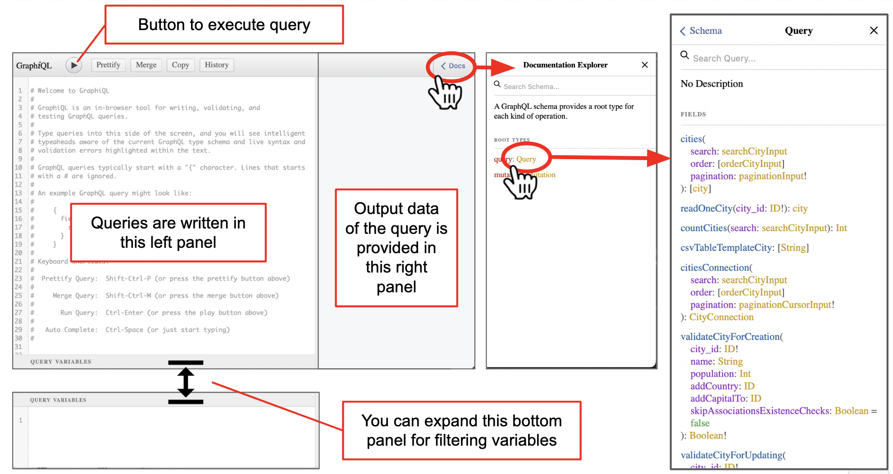
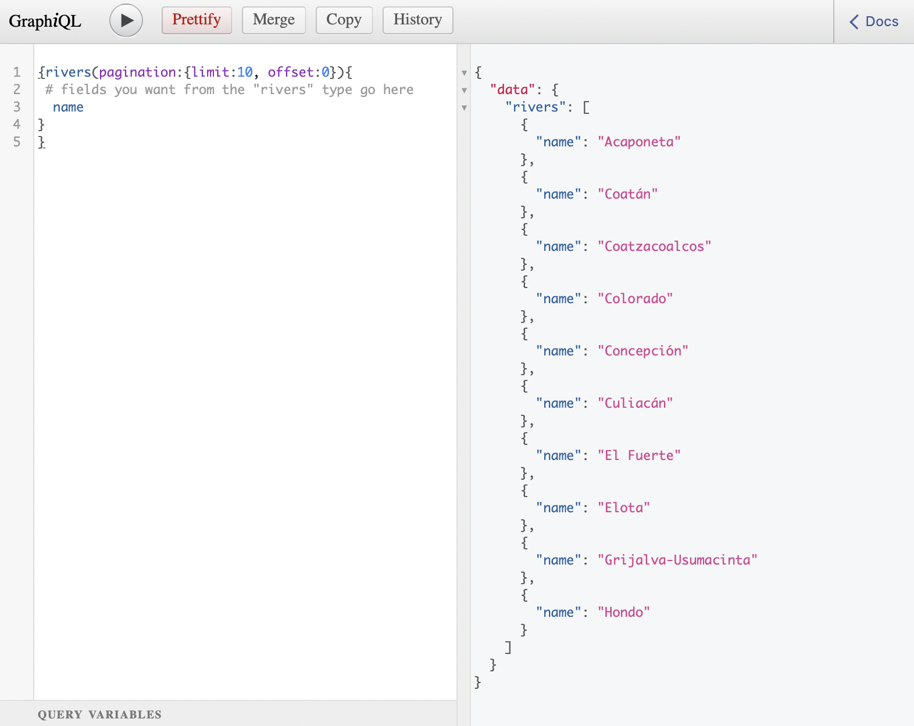
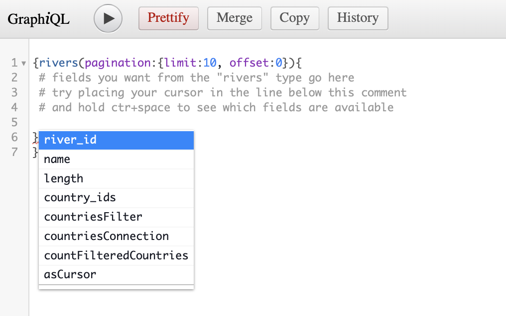
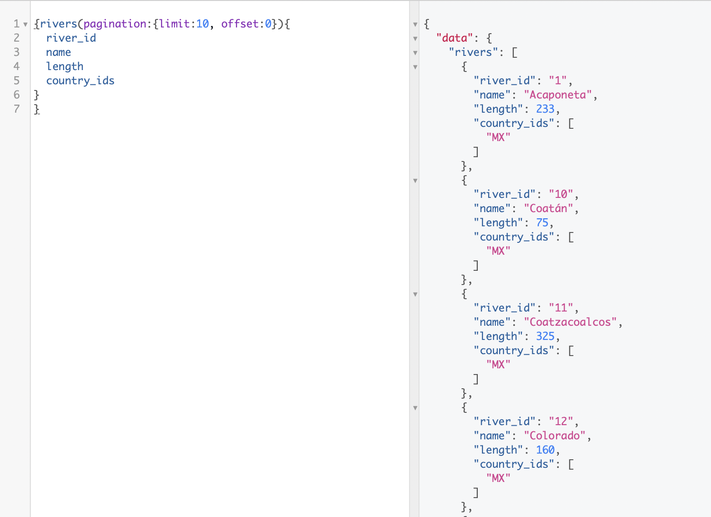
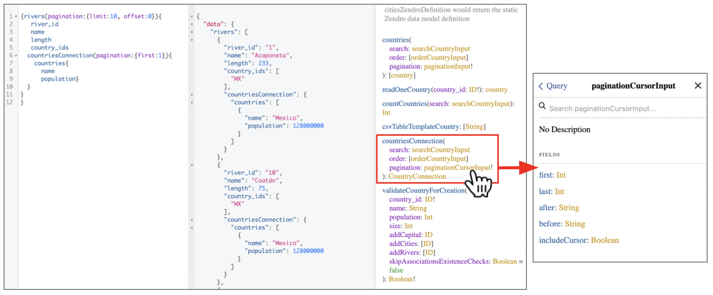

# Introduction to GraphQL and querying the API

GraphQL is a query language for Application Programming Interfaces (APIs), which documents what data is available in the API and allows to query and get exactly the data we want and nothing more. 

Queries are written in the GraphQL language, and the result (the data) is given back in JSON format. JSON (from JavaScript Object Notation) is a standard text-based format for representing structured data. It is widely used for transmitting data in web applications and it can easily be reformated into tables or data frames within programming languages like R or python. 

Zendro provides a GraphQL API web interface, called Graph**i**QL, which is a Web Browser tool for writing, validating, and testing GraphQL queries.

You can live-try an example here, which is the API that we will be using in this and other tutorials: [https://zendro.conabio.gob.mx/dummy_api](https://zendro.conabio.gob.mx/dummy_api).

Zendro's GraphQL API allows not only query the data, but also create, modify or delete records (`mutate`). This is available only with authentication (i.e. logging in with edit permissions) and won't be covered in this tutorial, but you can check other Zendro's How to guides for details on mutations.

## GraphiQL web interface

The GraphiQL API web interface has the following main components: 

* A **left panel** where you can write your query in GraphQL format.
* A **right panel** where the result of the query is provided in JSON format
* A **play button** to execute the query, which keyboard short cut is `Ctr+E`.
* A **Documentation Explorer** side menu, which you can show or hide clicking on "Docs" in the top right corner.  




The [GraphQL documentation](https://graphql.org/learn/) has the details, but in short data in GraphQL is organised in **types** and **fields** within those types. When thinking about your structured data, you can think of **types as the names of tables**, and **fields as the columns of those tables**. The records will be the rows of data from those tables. 

A GraphQL service is created by defining types and fields on those types, then providing functions for each field on each type. 

The documentation explorer allows to examine what operations (e.g. query, mutation) are allowed for each type. Then, clicking on `Query` will open another view with the details of what operations could be done to query the data. In this view, all types available in a given dataset are listed in alphabetical order, with the operations than can be done within them listed below. 

In the example of the image above, we can see that the first type is `cities`. Types can contain elements or arguments, which are specified inside `()`. Some of these may be required (marked with `!`), such as `pagination`.

## Writing queries

The [GraphQL documentation](https://graphql.org/learn/) includes plenty of resources to learn how to build queries and make the most out of the power of GraphQL. Below we provide just a very basic summary, after which we recommend you to explore [GraphQL documentation](https://graphql.org/learn/) to learn more. But feel free to try your queries in our [Zendro Dummy API](https://zendro.conabio.gob.mx/dummy_api) we set up for tests.

Some GraphQL syntax tips:

* Queries and other operations are written between `{}`. 
* Types can contain elements or arguments, which are specified inside `()`.
* Use `:` to set parameter arguments (e.g. `pagination:{limit:10, offset:0}`
* With `#` you can include comments within a query to document what you are doing.
* A query should provide at least a type (e.g. `rivers`) and at list a field (e.g. `names`) and any mandatory arguments the types have (marked with `!` in the Docs).
* In Zendro `pagination` is mandatory argument. It refers to the number of records (`limit`) the output should give back, starting from which record of the data (`offset`). If you don't specify the offset, by default this will be `offset:0` 

A very simple query will look like this:

```
{rivers(pagination:{limit:10, offset:0}){
   # fields you want from the "rivers" type go here
    name
  }
}
```

Copy-pasting and executing the former query in GrapiQL looks like the following image. That is, we got the names of the first 10 rivers of the data :



But how did we know that `name` is a field within `rivers`?

If you want to know what fields are available for the type `rivers` you can hold `ctrl+space` within the `{}` after `rivers(pagination:{limit:10, offset:0})`. A menu will appear showing you all possible fields. 



In this example, we can get the fields `river_id`, `name` and `country_ids`. The rest of the list is related to `countries`, because `rivers` is associated with `countries` and therefore we can build a more complex query with them.

But first, lets build a query to give us back the fields `river_id`, `name` and `country_ids` from the type `river`, like this:

```
{rivers(pagination:{limit:10, offset:0}){
      river_id
      name
      length
      country_ids  
   }
}
```

As a result of the query we will get for each of the 10 first rivers of the data we will get its id, its name and the id of any country it is associated to:



GraphQL can get fields associated with a record in different types, allowing us to get the data with only the variables and records we need form the entire dataset. 

For this, there would be a `Connection` for each each association the `river` model has. For example, we can extend the previous query to include data from the country type with `contriesConnection`.

```
{rivers(pagination:{limit:10, offset:0}){
      river_id
      name
      length
      country_ids  
     countriesConnection(pagination:{first:1}){
       countries{
         name
         population}
     }
   }
}
```

Remember to check the Docs for any mandatory argument. In this case `pagination` is mandatory. You can check what you are expected to write in its `paginationCursorInput` by clicking on it in the documentation. 

After you execute the query, you will get the same data we got for each river before, but also the data of the country (or countries, if it were the case) it is associated to. 




You can write much more complex queries to get the data you want. Please explore [GraphQL documentation](https://graphql.org/learn/) or many other resources out there to learn more. But the above examples should get you going if what you want is to get data to perform analyses in R or python.

Before trying to download data from R, python or any other using the GraphQL API, we recommend writing the query to the GraphiQL web interface and making sure it works. That is, it returns the desired data as in the right panel as in the image above.

Next step? Check Zendro How to guides for tutorials on how to use GraphQL API from R or python to explore and analyse data stored in Zendro.


