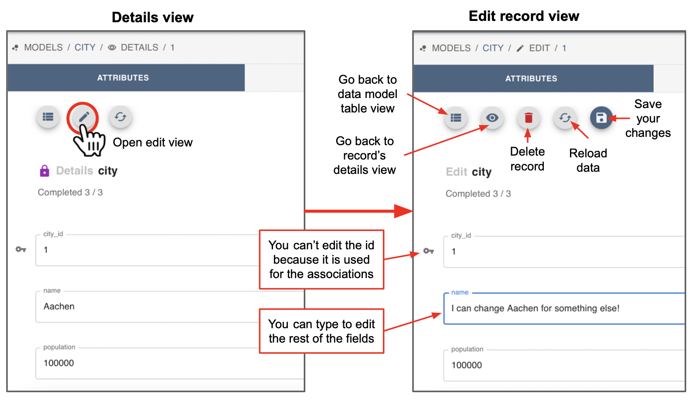
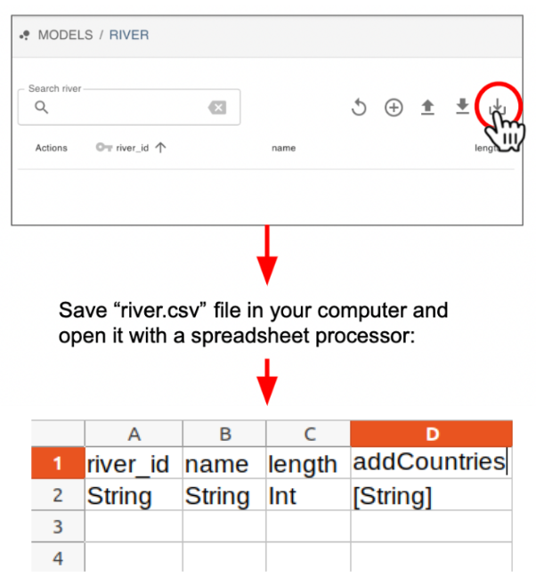

# How to use Zendro's graphical user interface


Zendro's graphical point and click user interface is accessible in a web browser, as a so-called single page application (SPA). 

To explore how it looks, you can look at the screenshots before, or even better try it out live! Just go to [https://zendro.conabio.gob.mx](https://zendro.conabio.gob.mx), where you would find a dummy Zendro instance we set up for you to try. 

Zendro's home graphical interface looks similar to the image below. But of course you can customise it to show what you prefer:

 
 
All data administration functions made available in the browser based point and click graphical user interface are subjected to user based access control, meaning the user is only seeing the respective icons, buttons, and even model names in the main menu, if and only if she / he has the required user-role providing access rights to the respective read or write operations. 

## Login

Clicking in LOGIN will prompt you for your user name and password. Zendro's graphical interface allows users to Create, Read, Update or Delete (CRUD) records, but you can decide which users can do what. For instance only one or two people on a research team may have edit access rights to create, update or delete records, while several other members of the team could be allowed to read.

We created a user with reading acess rights for you to explore. You can login with user the shown in the image bellow and the password *reader*.


## Exploring data

Upon successful sign-in in the graphical interface, the user is presented with an overview menu on the left, offering one entry per data model Zendro created components for. That is, Zendro will create a table for each of the data models provided when setting it up.

In this dummy example the models are "City", "River" and "Country". The home is shown in blank by default, but you can use this area to add whatever you want, like models documentation or project introduction. 


Clicking on a data model name will present the user with the **master data model table**, showing a column for each data model field (in this example "city_id", "name" and "population" of the "city" model), and the records in rows. 

 


If you are explorin a table with lots of rows, you can modify the number of rows the table shall show at a time by clicking on the number. The number of pages will be modified automatically to fit all the data to the desired number of rows per page. Try that in the river model:

SCREENSHOT CON RIVER CON MUCHOS ROWS

At the bottom right of the table the user can skip forward or backward trough pages:


You can hide or expand the left data models menu by clicking in the ">" icon:


Clicking on the column name will cause the data to be sorted by that column in alphabetically ascending order. Above the table the user can enter search terms which will be matched against any column, if the respective field is of type string (text), and against any numeric columns, if the entered search term can be translated to a number. 

For each record, the table offers the user the option to open the detailed view of a selected record ("eye" icon). For users with edit and delete access rights the options to edit ("pencil" icon) or delete the record ("trash" icon) are also shown:


You may have noticed that you can only see the "eye" icon to go the detailed view, but not the other icons. This is because the user we made public for this tutorial only has reader permissions and hence can not modify the existing data. 

Clicking on the "eye" icon leads to the detailed view, which enables to inspect in full details ("ATTRIBUTES" tab) that a single data record has:

 

If the user has edit permissions, here there would be shown buttons for opening the edit and delete forms. See [Editing data](## Editing data) below for details. 



In the detailed view all users also can see a tab called "ASSOCIATIONS"  at the top right which shows one entry per association that the respective record (data model) has. In this case the record of the city "Aachen" is associated with "COUNTRY" and "CAPITALTO".


Upon clicking on such an association name the user can now inspect the associated records. If this is an association of many records, i.e. one-to-many or many-to-many association type a table is shown just like the master table. This table has the same sorting, search, and pagination functions as the data model master table shown before. 


## Editing data

### Modify or delete existing records

For a user with all Create Read Update and Delete permissions, the master table offers the user the option to open the detailed view ("eye" icon), edit ("pencil" icon), or delete ("trash" icon) a given record:


Clicking on the "pencil" icon either in the data model master table or in the detail view will open the edit form, pre-filled with the selected records data. Here the user can change the data and will be presented with validation errors if the data is invalid. 


For example if I try to introduce character text in the "population" field, which is defined as an integer, I would be asked to instead enter a valid integer.


All fields can be modified in this form, except the id which is the key linking to the record associations. 

To edit the associations, on the "ASSOCIATIONS" tab click the name of the data model where the record to be associated is. For example "country". 

After clicking it, the user is shown a modified version of the data model master table, in which an additional column enables the association or dissociation of records with the currently edited one. Associated records are marked with a "link chain" icon, and not associated records with a "broken chain link" icon. In this table the user can mark several associations to be executed once the "save" button is clicked.  


Once any of the associated/not associated icons is clicked they revert to their respective counterpart, a connected chain link becomes a broken one and vice versa. To highlight that these are to be persisted changes the converted icons are highlighted in color, green connected chain link icons indicate that an association with the respective record shall be established, while red broken chain link icons indicate the opposite. 


The user can paginate through the whole set of records of the respective association and mark as many change operations as wished for. They will be collected and carried out, once the save button is clicked. Additionally the user can apply a variety of filters to the table. This includes filtering for already associated records as well as filtering those records that have been marked to be added or removed as an association. 

Once the desired associations have been made, click on the "save" icon at the top right menu:


Alternatively, if the record you wish to associate to does not exist, then it is possible to manually create it by clicking on the "+" icon at the top right menu:


### Add a single record manually

If your user has edition permissions, on the top bar of the data model table you will see the following buttons to Reload the data ("circle arrow" icon), Add new record ("+" icon), Import data as csv ("bold top arrow" icon), Download data as csv ("bold down arrow" icon) and Download the model template ("light down arrow" icon). If your user only has reading access you will only see the Reload and Download icons.


Notice that these buttons work independently for each data model table. That is, if you are in the "city" model you would be able to create or download records of the city table, but if you want to add a country you have to click in the "country" model in the left side menu.

The "+" icon enables the user to **Add a single new data record**, to the current data table. Upon clicking it, the user is presented with a form where the values for each field of the new record can be entered. 


If invalid data has been entered and the user attempts to save that invalid data, validation error messages are shown as in the example above when we edited and existing record. 

Once you finish typing the data click on the "save" icon. You don't need to add data to all fields, but you would be asked if you are sure you want to leave some fields blank. Click "yes" to proceed:


Your new record will be saved. You can click on the "table" icon on the top to see the country table again:


### Add several records from a file

Adding single records one by one is useful sometimes, but honestly we all want to add data in bulk. Users often have data in tables that were created in MS Excel, recorded with a digital device or by any other mean. You can import this data into Zendro by creating a coma separated values file ("csv file"). 

The csv file is expected to have the **same** fields of the data model you want to add data to, and follow the format requirements below:

1. Column names in the first row must correspond to model attributes.
2. Empty values should be represented as `"NULL"` (**with** the `""`)
3. **All** records should be quoted by `"`. However, if field delimiter and array delimiter do not occur in fields with String type, namely characters could be splitted without ambiguity, then each field could not be quoted. For example, if the field delimiter is comma, and one String field is like `Zendro, excellent!`. Without the quotation mark, this field would be splitted as two fields. So in such case these String fields must be quoted.
5. Date and time formats must follow the [RFC 3339](https://tools.ietf.org/html/rfc3339) standard.

In order to get the field names right and check what type (e.g. integer, character, etc) is each one, you can **Download the model template** by clicking in the "light down arrow" at the top right panel of the master data model table. You will be prompted to download a csv file named after the table you are, for example "river". You can open this file in your favourite spreadsheet processor (e.g. Excel).

It will have the the column names you need in the first row, and the data type in the second. Notice that if your data model has associations the ids ("key") associating records will be shown as columns too. For example because the model "river" is associated with "country" you have to provide the `country_id` in the last column. If we fill this example with a list of Mexican rivers, this means that the `country_id` field should include Mexico's country id, which from the "country" data model table we know is "MX".



Next edit this csv file to add your data. Make sure to:

* Leave the first line (column names) as it is.
* Replace the second row with data, but remember: the second row is there to tell you what type of data is Zendro expecting for each field, e.g. `Int` = integer numbers, and `String` = text. 
* Follow the data requirements detailed above.

Remember, **all data should be quoted** with `""`. If you are working with MS Excel and don't want to manually add the quotes, try this:

1. Select all data cells (not the column names!)
2. Go to Format –> Cells –> Custom
3. Copy/Paste the following into the Type field: `\“#\”;\“@\”`
4. Click “okay”


Now save your data as csv. For this:

1. Go to File -> Save as...
2. On the File format menu select `CSV UTF-8 (Comma-delimited) (.csv)`
3. Save your file somewhere nice.


To double check that your file looks how it should, open it with a Text Editor. You should look something like this:

```
river_id,name,length,country_ids
“1”,“Acaponeta”,“233”,“MX”
“2”,“Ameca”,“205”,“MX”
“3”,“Armería”,“240”,“MX”
“4”,“Balsas”,“770”,“MX”
“5”,“Baluarte”,“142”,“MX”
“6”,“Bravo”,“NULL”,“MX”
“7”,“Candelaria”,“150”,“MX”
“8”,“Cazones”,“145”,“MX”
“9”,“Coahuayana”,“203”,“MX”
“10”,“Coatán”,“75”,“MX”
“11”,“Coatzacoalcos”,“325”,“MX”
“12”,“Colorado”,“160”,“MX”
“13”,“Concepción”,“335”,“MX”
“14”,“Culiacán”,“875”,“MX”
“15”,“El Fuerte”,“540”,“MX”
“16”,“Elota”,“65”,“MX”
“17”,“Grijalva-Usumacinta”,“1521”,“MX”
“18”,“Hondo”,“115”,“MX”
```

To finally upload your data to Zendro click on the Import data as csv ("bold top arrow" icon) of the top right menu:


## Download data


