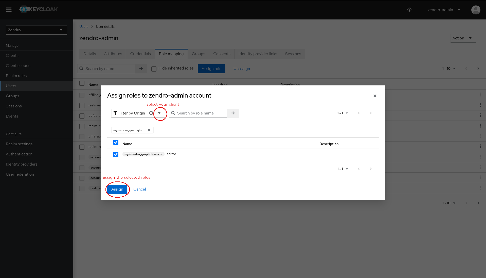

# Distributed Data Models

Zendro provides the ability to build a network of zendro graphql-servers, able to talk to and request data from each other, as long as the graphql schema for a given model is identical to all zendro instances inside the cloud of graphql-servers.

To do so it is necessary to define your data-model as storageType "distributed-data-model" (ddm) and provide zendro with adapters to either a local storage database or another zendro instance to be queried for data. Since Zendros data-model-definitions aim to be atomic and independent of any other model, those adapters have be defined as separate data models, even though they are linked to the distributed-data-model (ddm). That means that only the ddm is exposed to the graphql-schema, the adapters are then used internally to request the expected data.

## Data model definition

Defining a distributed-data-model (ddm) and its adapters requires some special attributes in the model definition:


| Name | Type | Description |
| ----------------- | ----------------- | ----------------------- |
| registry | String[] | List of registered adapters the ddm should request |
| internalId | String | While optional in basic models, ddms require a String identifier attribute, instead of e.g. the default numeric sequence. |
| adapterName | String | Only used in the adapter definitions. References the name given in the "registry" List. The adpaterName _must_ be kept consistent and unique over your zendro nodes, meaning it should always point to the same endpoint. | 
| regex | String | Only used in the adapter definitions. Regular expression used to identify the adapter a specific record belongs to (using its internalId). This is used to identify responsible adapters for read-one and write actions | 
| url | String | Only used in ddm-adapter definitions | URL of the graphql-server to forward the requests to. |


Below is an example of a distributed "country" model, with two so-called "adapters", one "local" adapter that directly connects to a relational database and one "remote" adapter that simply forwards the request to the next zendro node in the network, given a URL. Each adapter you want the distributed-data-model to be aware of needs to be defined as such in a separate JSON data-model-definition file.

```js
// Country definition File
{
  "model": "country",
  // set the storage-type to distributed-data-model
  "storageType": "distributed-data-model",
  // Use the "registry" key to register a list of adapters you want this
  // specific model to be aware of. 
  "registry": ["country-server1","country-server2"],
  // distributed data-models have to use an internalId of type String. This is
  // so the model can differentiate between the registered adapters using the id
  // and a regular expression.
  "internalId": "id",
  "attributes": {
    "id": "String",
    "name": "String",
    "population": "Int"
  }
}
```

```js
// Country local adapter file
{
  // Use the same name as above "ddm" definition
  "model": "country",
  // set the storage type to the desired type and add a "-adapter" to signal
  // that this model functions as an adapter.
  "storageType": "sql-adapter",
  // Reference the name given in the "registry" list of the
  // distributed-data-model above
  "adapterName": "country-server1",
  // Regular expression to determine whether a record can be fetched using this
  // adapter. In this example the ids of country-records stored on this local
  // sql-adapter use a "/countries/server1" signature.
  "regex": "/countries/server1",
  // distributed data-models have to use an internalId of type String. This is
  // so the model can differentiate between the registered adapters using the id
  // and a regular expression.
  "internalId": "id",
  // The adapter uses the same attributes defined in the above
  // distributed-data-model definition
  "attributes": {
    "id": "String",
    "name": "String",
    "population": "Int"
  }
}
```

```js
{
  // Use the same name as above "ddm" definition
  "model": "country",
  // The ddm-adapter type is used to signal zendro that this adapter forwards
  // the request to another zendro instance. The other zendro instance also has
  // a registered distributed-data-model which then handles the request
  // accordingly (e.g. ask its registered local mongodb-adapter for data).
  "storageType": "ddm-adapter",
  // The graphql-server URL of the remote zendro instance, used to forward the
  // incoming request.
  "url": "http://<server2>/graphql",
  // Reference the name given in the "registry" list of the
  // distributed-data-model above
  "adapterName": "country-server2",
  // Regular expression to determine whether a record can be fetched using this
  // adapter. In this example the ids of country-records stored on this local
  // sql-adapter use a "/countries/server2" signature.
  "regex": "/countries/server2",
  // distributed data-models have to use an internalId of type String. This is
  // so the model can differentiate between the registered adapters using the id
  // and a regular expression.
  "internalId": "id",
  // The adapter uses the same attributes defined in the above
  // distributed-data-model definition
  "attributes": {
    "id": "String",
    "name": "String",
    "population": "Int"
  }
}
```

## Functionality

Zendros distributed-data-model work efficiently by distributing incoming requests onto the corresponding responsible adapters. When the user sends any graphql request (query or mutation) the distributed-data-model (ddm) will pass along the request to its registered adapters, collect the results and post-process any necessary modifications in-memory (e.g. sorting all results fetched from different adapters).

In case of read-one and write actions the ddm recognizes a responsible adapter via the given regular expression on the `internalId` field. For that each adapter exposes a simple function to recognize if they are responsible:

```js
/**
 * recognizeId - test whether this adapter is responsible for a given iri (id).
 * It does this via a simple match of a regular expression.
 * @param {string} iri - The iri to test
 * @return {boolean} returns true if match, false otherwise
 */
static recognizeId(iri) {
  return iriRegex.test(iri);
}
```
If desired, this function can be customized separately for each adapter. Instead of using a regular expression to distinguish between adapters any function that returns a `boolean` value given an id can be used.

When the responsible adapter is found the ddm can forward the request to the adapter, collect the result and return it to the user.

In case of a read-many function the ddm will query _all_ registered adapters for the data. It will pass along any query parameters given (search, order, pagination), collect the results and return them to the user. Any errors encountered from querying the different nodes in the network will be passed along and displayed as benign, while data from working nodes is still returned. An example of a two-server zendro network is depicted below:  


||
|:--|
|A depiction of a two-server zendro network using distributed-data-models. The green arrows show the flow of a request to "Graphql server 1". The user will request some data and after passing the resolver layer for authorization checks the "distributed-data-model" forwards the request to its 2 registered adapters. One "local" adapter which will immediately query a database and one "remote" adapter which will forward the graphql-request to "Graphql server 2". This will in turn go through the resolver of Graphql Server 2 and again distributed to the registered adapters by the "distributed-data-model". Here zendro automatically prevents a circular request by _not_ sending the request back through the "remote adapter" of server 2. However the "local adapter" of server 2 will in turn query its connected database and return the data back to the user. After collecting all data the distributed-data-model in server 1 will do any necessary post-processing like sorting etc. and return the data to the user.|


### Cursor-based Pagination

To make sure distributed-data-models can be paginated efficiently they only support cursor-based pagination. See the documentation of the [Pagination Argument](api_graphql.md#pagination-argument) for more information. Since the ddm will fetch data from multiple sources and databases we cannot use the classic limit-offset based pagination. Instead, when requesting paginated data zendro sends along a cursor (a base64 encoded record) and the amount (first or last x records) to all data sources and fetches data after, or before that cursor. After all returned data is collected a final pagination to the first, or last number of requested records is done in memory and send to the user.

## Network topologies

Depending on the use-case several different topologies of "zendro-networks" can be achieved by configuring the data-model-definitions on each participating zendro instance. Below are two examples on how different setups could be achieved. Note that this list is _not_ exhaustive. Zendro makes sure to prevent any circular requests by excluding adapters that already have been queried.


### Example 1: Mesh topology


A mesh topology where each participating zendro node has access to all other zendro nodes in the network can be achieved simply by making all nodes aware of each other. In practical terms that means on every zendro instance exists a model of storagetype "distributed-data-model", a ddmadapter for every zendro-node in the network and, if exists, an adapter to a local storage. That means, no matter from which node a user requests data, _every_ node in the network will return the data stored at their local site and the end result will include data from _all_ zendro nodes in the network.
### Example 2: Master-slave topology


A master-slave topology where one zendro-node acts as a central controller can be achieved by only making the central node aware of the other instances. To do so, only that node defines a model of storagetype "distributed-data-model" and ddm-adapters for each node in the network. All other secondary nodes do _not_ need a "distributed-data-model" in this case. That means that only when querying the central node, data from all other nodes will be returned. If a user queryies one of the secondary nodes only data specifically from the requested node can be returned.


## Performance and Limitations

Zendro ensures performance of any kind of distributed setup through multiple strategies. 

First and foremost the overhead resulting from distributing the incoming request to multiple adapters is kept at a minimum. Due to the paginated nature of results collected at the distributed-data-model post-processing of the data in memory is usually very fast. Only the collected result has to sorted and paginated once from the individual adapter results. Keep in mind that all parameters (search, oder, pagination) are forwarded to the adapters, which will take care of the execution of the database queries. Requests from the distributed-data-model are send to adapters in parallel, the limiting factor will be the slowest node in the network to return data.

To ensure efficient read of associations it is recommend to use [paired-end foreign keys](setup_data_scheme.md#paired-end-foreign-keys) for any associations among distributed data models. This ensures that associations can be resolved directly from the read record itself instead of the need to query multiple distributed zendro instances for records matching the requested association.

Due to Zendro requiring the use of a pagination argument the user needs to think about what and especially how much data he is requesting. Scaling up a zendro network to include a lot of nodes means that for each of the connected databases a query with the requested pagination will be send and that data has to be collected in memory at the requesting node. This can grow quickly out of proportion if a network and the requested data become very big.

## Authorization and Authentication

Handling authorization and authentication in a network of zendro instances requires some manual setup. The following guide intents to give solutions for zendros default authorization setup using [keycloak](https://www.keycloak.org/). See also the documentation on [authorization and authentication](oauth.md).

Generally it is recommended to use a single authorization endpoint for all zendro nodes in the network, however it is also conceivable, depending on the users needs to setup multiple authorization endpoints. This guide will focus on using a single endpoint.


### Removing the docker-containers and migration

*In case you are not using docker to start up your zendro services you should do the equivalent steps on your local server*

Since only one of the zendro nodes should expose the keycloak endpoint you should remove the keycloak services from your docker-compose files for all _other_ zenro nodes.

```yml
services:

  # comment or remove the following services:
  zendro-keycloak-postgres:
    container_name: zendro-keycloak-postgres
    ...
  
  zendro-keycloak:
    container_name: zendro-keycloak
    ...

  # Also make sure to remove the zendro-graphql-server dependency
  zendro-graphql-server:
    container_name: zendro-graphql-server
    # comment or remove the depends_on
    depends_on:
      - zendro-keycloak
    ...

```

You should also remove the keycloak migration file from your migrations folder to prevent zendro from running and failing the migration. This migration only needs to be run _once_ on the node that handles the keycloak endpoint.

```
/<my-zendro-app>
|--- graphql-server
|    |--- migrations
|    |    |--- 2021-12-08T17_37_17.804Z#keycloak.js //remove this file
|    |    |--- ...
|    |--- ...
|--- ...
```

When starting zendro via the `zendro dockerize` command after doing the previous steps zendro should not start the `zendro-keycloak` and `zendro-keycloak-postgres` services.

### Create the clients
To enable all zendro web-clients in the network communication with the keycloak endpoint they need to be registered as clients in keycloak. There is multiple ways to do so, this guide will focus on doing it via the [keycloak admin-console](https://www.keycloak.org/docs/latest/server_admin/).

Go to http://localhost:8081/auth/admin/zendro/console and login with a zendro user. The default user created is
```
username: zendro-admin
password: admin
```
After login go to the clients menu and click on "import client":


You can find the default clients to import in the `config` folder:

```
/<my-zendro-app>
|--- config
|    |--- zendro_graphiql.json 
|    |--- zendro_spa.json
|    |--- zendro_graphql-server.json
|    |--- ...
|--- ...
```

import both the `zendro_graphiql.json` and `zendro_spa.json` clients. Change their `Client ID` to something meaningful given the context of the zendro network.


After importing, make sure to save the clients by clicking the "Save" button at the end of the page.

### Create the graphql-server client (optional)
If you want the graphql-server of any given zendro node to be able to directly communicate with keycloak you can also register it as a client. This is only necessary if you want users to be able to programmatically receive a token using credentials or create roles specific to that zendro instance. By default the zendro instance that exposes keycloak will register its graphql-server as a client that can be used, so in theory it is not necessary to do so.

Follow the same steps depicted above, import the `zendro_graphql-server.json` client and change its name to something meaningful.

#### Roles

If you create a client for your graphql-server, by default it does _not_ expose any client roles. If you want to use that endpoint to decode roles, or implement custom roles on that zendro node, you have to add those roles manually.

**_Note_**: Be aware that the zendro single-page-app expects at least an "editor" and "reader" role to be present in the token.

To do so go to the newly create client and add the role in the roles tab using the "Create role" Button:


After doing so any user can be given the newly created client-roles via the admin-console.

In te "Users" menu, select a user, navigate to the "Role mapping" tab, click on the "Assign role" button, select to filter by your client and assign the role:



### Setup the environment

After registering all necessary clients to keycloak the corresponding environment variables have to set manually for the different zendro services.

#### Web-services
To make the web-services aware of their keycloak client representations the `OAUTH2_CLIENT_ID` and `OAUTH2_CLIENT_SECRET` need to set in the .env files:

```
/<my-zendro-app>
|--- single-page-app
|    |--- .env.development 
|    |--- .env.production
|    |--- ...
|--- graphiql-auth
|    |--- .env.development 
|    |--- .env.production
|    |--- ...
|--- ...
```

To find out the client ID and client Secret go to the "Clients" Menu and select the corresponding newly created client. The Client ID can be copied from there:


The client secret can be found in the "Credentials" tab and copied from there:

.

Copy and paste these two values into your single-page-app and graphiql-auth environment files:

```
# single-page-app .env
...
OAUTH2_CLIENT_ID="<my-spa-client-id>"
OAUTH2_CLIENT_SECRET="<my-spa-client-secret>"

# graphiql-auth .env
OAUTH2_CLIENT_ID="<my-graphiql-auth-client-id>"
OAUTH2_CLIENT_SECRET="<my-graphiql-auth-client-secret>"
```

#### Graphql-server

The graphql-server needs to be made aware of the keycloak zendro-realm public key. This is controlled via the `OAUTH2_PUBLIC_KEY` environment variable.

To get the public key navigate to the "Realm settings" menu and find the public key under the "Keys" tab. Click on the "RS256" "Public key" button and copy the key:

.

Alternatively find the public key by requesting `http://localhost:8081/auth/realms/zendro` (interchane localhost:8081 with your keycloak endpoint).

After copying the key enter it into the graphql-server .env file:

```
/<my-zendro-app>
|--- graphql-server
|    |--- .env
|    |--- ...
|--- ...
```

**_Note_**: Make sure to add the public key signature like so:

```
...
OAUTH2_PUBLIC_KEY="-----BEGIN PUBLIC KEY-----\n<my-public-key>\n-----END PUBLIC KEY-----"
```

Depending on whether you created a separate client for the graphql-server you can pass that Client ID to the graphql-server via the `OAUTH2_ClIENT_ID` environment variable:

```
OAUTH2_CLIENT_ID="<my-graphql-server-client-id>"
```

This environment variable determines the resource from where the graphql-server decodes the user-roles from the token. If you manually create roles you will have to pass your Client ID here. If you want to use the default roles used by the graphql-server that is registered by default, you can pass the Client ID of that server.

That's it. It should now be possible to login from any of your zendro web-services using a central keycloak authentication service.