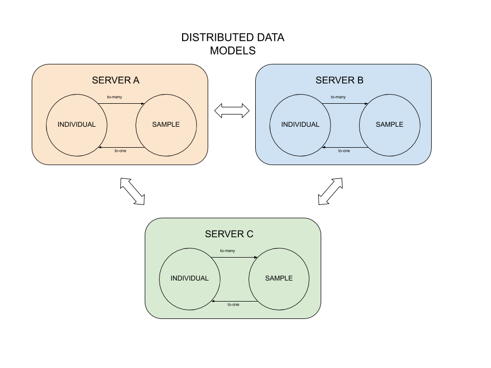

# Distributed Data Models

In(at?) Zendro is possible to integrate data which follows a same data model description stored in diferent servers. For example, let say there is two research groups working in the same topic, each one of them stores their data in their own servers. Distrubuted data models will allow them to access both data sets from one same access point created with Zendro.
The description for this type of models follows the same description here(insert link), with some extra fields marked in bold in the following table, but also we will need to specify an adapter for each one of the data sets.  

Name | Type | Description
------- | ------- | --------------
*model* | String | Name of the model (it is recommended to use snake_case naming style to obtain nice names in the auto-generated GraphQL API). The string here can not contain spaces.
*storageType* | String | Type of storage where the model is stored. In this case the storage type should be _distributed-data-model_
*__registry__* | Array | Array of strings, each string is the name of one of the adapters(insert link here to adapters description) that the distributed data model  is integrating.
*attributes* | Object |  The key of each entry is the name of the attribute and there are two options for the value . It can be either a string indicating the type of the attribute or an object where the user indicates the type of the attribute(in the _type_ field) together with an attribute's description (in the _description_ field). See the [table](#supported-data-types) below for allowed types. Example of option one: ```{ "attribute1" : "String", "attribute2: "Int" }``` Example of option two: ``` { "attribute1" : {"type" :"String", "description": "Some description"}, "attribute2: "Int ```
*associations* | Object | The key of each entry is the name of the association and the value should be an object describing the corresponding association. See [Associations Spec](#associations-spec) section below for details.
*internalId* | String | This string corresponds to the name of the attribute that uniquely identifies a record. If this field is not specified, an _id_, default attribute, will be added.


## ADAPTERS

 An adapter in Zendro is a json file which describes how and which data can be accessed from a _distributed data model_ instance of Zendro.
 The user needs one adapter for each server and for each model that the _distributed data model_ instance will integrate. The adapter's json file also follows the description for data models (insert link), with some extra fields marked in bold in the following table.

 Name | Type | Description
 ------- | ------- | --------------
 *model* | String | Name of the model (it is recommended to use snake_case naming style to obtain nice names in the auto-generated GraphQL API). The string here can not contain spaces.
 *__storageType__* | String | Type of storage where the remote or local data is stored. So far there is 4 possible types of adapters: <ul><li> __sql-adapter__ - for data stored locally  </li> <li>__ddm-adapter__ - for data stored remotely in another distributed data models zendro instance</li> <li>__zendro-webservice-adapter__ - for data stored remotely in a general zendro instance </li> <li>__generic-adapter__ - for data stored in a non-zendro server </li></ul>
 *__adapterName__* | String | Name of the adapter, this name will be used in the __registry__ (insert link) of a *distributed data model* zendro instance.
  *__regex__* | String | Regular expresion, this regular expresion is used by the *distributed data model* zendro instance in order to know which adapter will be the one in charge of performing the operation with a given registry or set of registries. Each registry accessed through this adapter has in its id this regular expression.
  *__url__* | String | Url where data, that this adapter is responsible to integrate, can be fetched.
 *attributes* | Object |  The key of each entry is the name of the attribute and there are two options for the value . It can be either a string indicating the type of the attribute or an object where the user indicates the type of the attribute(in the _type_ field) together with an attribute's description (in the _description_ field). See the [table](#supported-data-types) below for allowed types. Example of option one: ```{ "attribute1" : "String", "attribute2: "Int" }``` Example of option two: ``` { "attribute1" : {"type" :"String", "description": "Some description"}, "attribute2: "Int ```
 *associations* | Object | The key of each entry is the name of the association and the value should be an object describing the corresponding association. See [Associations Spec](#associations-spec) section below for details.
 *internalId* | String | This string corresponds to the name of the attribute that uniquely identifies a record. If this field is not specified, an _id_, default attribute, will be added.


## EXAMPLE

In this example we will assume that there are three research groups(A, B and C), they work with the same data models and share their data, but each one of them has its own server set with Zendro tools and definitions. Because they share their data, the right zendro approach to model this situation is to use __distributed data models__.

The models are _sample_ and _individual_ , a sample belongs to one individual and one individual can have many samples. Each one of the groups need to define their models and adapters. Without loss of generality, let's assume that we are setting the server for research group A.



#### MODELS

```json
{
  "model": "sample",
  "storageType": "distributed-data-model",
  "registry": ["SERVER_A","SERVER_B","SERVER_C"],
  "attributes":{
    "id": "String",
    "name": "String",
    "material": "String",
    "life_cycle_phase": "String",
    "description": "String",
    "individual_id": "Int"
  },
  "associations":{
    "individual":{
      "type" : "to_one",
      "target" : "individual",
      "targetKey" : "individual_id",
      "keyIn": "sample",
      "targetStorageType" : "distributed-data-model",
      "label" : "name"
    }
  },
  "internalId": "id"
}
```

```json
{
  "model": "individual",
  "storageType": "distributed-data-model",
  "registry": ["SERVER_A","SERVER_B","SERVER_C"],
  "attributes":{
    "id": "String",
    "name": "String",
    "description": "String"
  },
  "associations":{
    "sample":{
      "type" : "to_many",
      "target" : "sample",
      "targetKey" : "individual_id",
      "keyIn": "sample",
      "targetStorageType" : "distributed-data-model",
      "label" : "name"
    }
  },
  "internalId": "id"
}
```
The points to notice from this example definitions are:
* The array __registry__ contains the names of the adapters that are describe below.
* ID, whichever it is its name, should be of type String because all ids stored locally need to match a certain regular expression that also well be specified in the adapter definition.

#### ADAPTERS

For each model and for each server that will be connected, an adapter needs to be defined.
In our example we would need three adapters for model _sample_ and three adapters for model _individual_. Be aware that a local adapter is needed for local data.  
For simplicity we will only define the three adapters for model _sample_.

```json
{
  "model": "sample",
  "storageType": "sql-adapter",
  "adapterName": "SERVER_A",
  "regex": "server_a",
  "attributes":{
    "id": "String",
    "name": "String",
    "material": "String",
    "life_cycle_phase": "String",
    "description": "String",
    "individual_id": "Int"
  },
  "associations":{
    "individual":{
      "type" : "to_one",
      "target" : "individual",
      "targetKey" : "individual_id",
      "keyIn": "sample",
      "targetStorageType" : "distributed-data-model",
      "label" : "name"
    }
  },
  "internalId": "id"
}
```

```json
{
  "model": "sample",
  "storageType": "ddm-adapter",
  "adapterName": "SERVER_B",
  "regex": "server_b",
  "url": "http://server_from_group_B.com/graphql",
  "attributes":{
    "id": "String",
    "name": "String",
    "material": "String",
    "life_cycle_phase": "String",
    "description": "String",
    "individual_id": "Int"
  },
  "associations":{
    "individual":{
      "type" : "to_one",
      "target" : "individual",
      "targetKey" : "individual_id",
      "keyIn": "sample",
      #"targetStorageType" : "distributed-data-model",
      "label" : "name"
    }
  },
  "internalId": "id"
}
```

```json
{
  "model": "sample",
  "storageType": "ddm-adapter",
  "adapterName": "SERVER_C",
  "regex": "server_c",
  "url": "http://server_from_group_C.com/graphql",
  "attributes":{
    "id": "String",
    "name": "String",
    "material": "String",
    "life_cycle_phase": "String",
    "description": "String",
    "individual_id": "Int"
  },
  "associations":{
    "individual":{
      "type" : "to_one",
      "target" : "individual",
      "targetKey" : "individual_id",
      "keyIn": "sample",
      #"targetStorageType" : "distributed-data-model",
      "label" : "name"
    }
  },
  "internalId": "id"
}
```


#### NOTES

* Id field should be type _String_.
* It's assumed that all ids from one server match the regular expression specified in the adapters.
* Is it mandatory url in sql-adapter?
* Is it mandatory targetStorageType in associations in adapters?.


## API QUERY EXAMPLES

```
{
  readOneSample(id: "server_b_id_1"){
    name
    description
  }
}
```
If we perform this query from __server A__ , the distributed data models approach allow the server to redirect the query to __server B__ because the id matches the regular expression that is used in the ids from __server B__, and this regular expression is the one specified in the correspondat adapter.

```
sampleConnections(pagination:{first: 10}){
  edges{
    node{
      name
      description
    }
  }
  pageInfo{
    cursor
    hasNextPage
  }
}
```
Internally this query will fetch the 10 first samples from each server, then it will sort them and return the first 10 along with the cursor information.  


## PAGINATION IN DISTRIBUTED DATA MODELS

In Zendro we manage two types of pagination, offset and cursor based pagination, nevertheless in distributed data models only cursor based pagination works and only connections queries approach work for fetching data. For more information about connections approach, please go [here](https://relay.dev/graphql/connections.htm).

###  Pagination problem in distributed storage

Assume a distributed network comprising two remote data warehouses France (Fr) and Germany (Ge). Both host records of the data model Book. Note that in this example we represent the book records with letters A to Z. A central layer (CL) aims at integrating data obtained from each of the two remote data-warehouses.
Suppose that remote server Fr stores books A, C and E, and remote server Ge stores books B, D and F.

The central layer server integrates data from the remote Fr and Ge data-warehouses, by requesting subsets (pages) from each of them respectively, sorting the results locally and finally by applying the limit-offeset pagination methodology on the joined data fetched from each remote warehouse.

With the next queries examples fetching books from the central server we will expose why limit-offeset based pagination is not an efficient solution for distributed storage.

1. Fetch from central server batch one with parameters _limit: 2_ and _offset:0_.

    * Remote server Fr will return books: A and C.
    * Remote server Ge will return books: B and D.
    * Finally the central server will process both outputs and will return A and B, being these both books the first two in the total order (A, B, C, D).

  Until here it seems that the limit-offeset pagination is not a problem for distributed storage, but let's see what happens when fetching the next batch from central server.

2. Fetch from central server batch two with parameters _limit:2_ and _offset:2_

    * Remote server Fr will return book: E.
    * Remote server Ge will return book: F.
    * Finally the central server will process both outputs and will return E and F, being these both books the first two in the total order of the joined data (E, F).

As we can see the correct answer should be books: C and D, from the total order of all books in both servers:  A, B, C, D, E, F.
Distributed limit-offset based pagination only works when sorting the union of *all* remote datasets locally and then applying limit-offeset pagination methodology, this approach is clearly inneficient.

nevertheless with cursor based pagination this problem is solved because with the partial results from each server, the central response can be created. See example below assuming same configuration with servers Fr, Ge and central.

  1. Fetch from central server batch one with parameters _cursor:B_ and _limit: 2_.
    * Remote server Fr will return book: C, E.
    * Remote server Ge will return book: D, F.
    * Finally centrar server will sort the outputs and return C, D which is the expected result.

Cursor based pagination works in distributed storage without the requirement of fetching all records from the remote servers.


## TO DO
 - [x] Mention that only cursor based pagination works in this case
 - [x] _Read all_ is not implemented, only via "Connections"
 - [x] Add description of an example with a image representing the topology of the example
 - [x] Add json description of the above
 - [x] API examples
