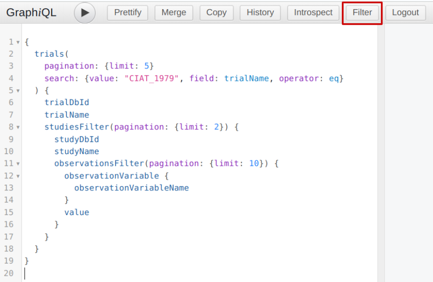
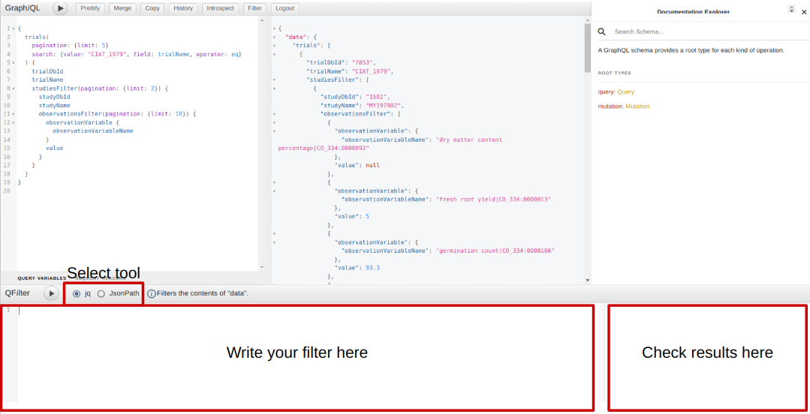
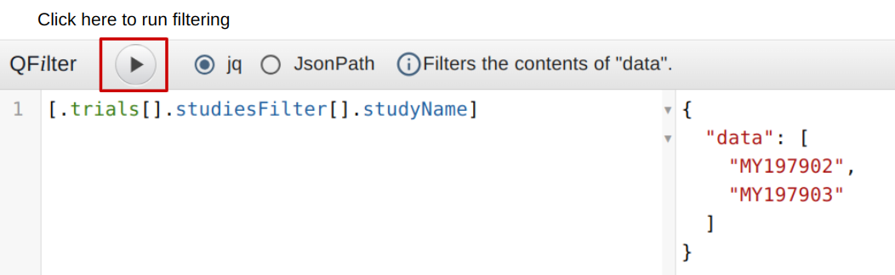
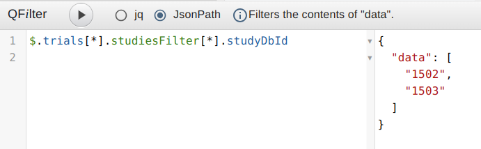

# GraphQL filtering using jq and JsonPath
{: .no_toc }

## Table of contents
{: .no_toc .text-delta }

1. TOC
{:toc}

---


## What is jq?

[jq](https://stedolan.github.io/jq/) is a lightweight and flexible command-line JSON processor. It is used to extract and manipulate data from JSON documents with simple and powerful filters, and it allows you to transform JSON data in various ways.

Why use jq?
- **Filtering**: You can quickly filter, slice, and extract specific parts of JSON.
- **Transformation**: jq allows you to modify JSON structures, making it useful for cleaning, formatting, or transforming JSON data.
- **Simplicity**: With a simple syntax, you can do complex manipulations easily.

### Why jq is used with GraphQL:

When working with GraphQL, the response data is  returned in JSON format. Since GraphQL allows for flexible queries, the structure of the returned data can vary significantly, making it necessary to manipulate the response data for specific use cases. This is where jq comes in. 

After querying a GraphQL endpoint, you might need to isolate or transform the returned JSON data for processing. `jq` makes this easy, enabling you to select only the necessary fields from the complex JSON response.

## What is jsonpath?

[jsonpath](https://goessner.net/articles/JsonPath/) is a query language for JSON, similar to XPath for XML. It allows you to extract specific parts of a JSON document based on a path expression. jsonpath is often used when interacting with JSON data in various programming environments.

Why use jsonpath?
- **Simplifies JSON querying**: It enables easy navigation and extraction from nested JSON structures using path expressions.
- **Integration with APIs**: Many tools and libraries support jsonpath for working with JSON-based APIs.
- **Efficient Data Extraction**: With jsonpath, you can extract only the necessary data, saving time and resources.

### Why jsonpath is used with GraphQL:

GraphQL responses are JSON-based, and the data can often be deeply nested or include numerous fields. jsonpath provides a simple and readable way to extract specific data from this structure, making it an excellent tool for working with GraphQL results.

## Example Usage

In real-world scenarios, especially when dealing with GraphQL APIs, tools like `jq` and `jsonpath` can help you interact with the responses more efficiently. 

Zendro GraphiQL integrate these filtering techniques directly into their user interfaces.

### Filtering in Zendro

Zendro's GraphiQL interface provides a flexible and interactive way to query the data. Within this interface, you can apply filters directly to your queries to refine the response data. The interface allows you to easily request only the fields you need and presents the data in a JSON format.

In the results, you can see the JSON output, which can be further processed with `jq` or `jsonpath` for specific tasks, such as:
- **Filtering Specific Fields**: You can extract only the fields that matter to you from the GraphQL response.
- **Nested Data Extraction**: The interface allows you to deal with nested data structures, and with additional tools like `jq` or `jsonpath`, you can query deeper levels of the data tree.

Once you have the query, at the top of the interface, there are several buttons. If you click on `Filter`, a section will open at the bottom of the screen where you can select the option you want to use: `jq` or `JsonPath`, the space to write your filter, and the window where you can see the results.





The filters you use will be applied to the query results. 

You can reproduce the results by accessing to the [Zendro-BrAPI data warehouse](https://brapi-graphiql.zendro-dev.org/).

### Filtering with jq

For example, if we want to get the names of the studies in the trial example, since we are only calling 2 `(limit:2)`, we expect to have 2 names:



#### Explanation:

- `.trials[]`: Here, `.trials` accesses the `trials` property of the root object. The `[]` at the end of `trials` indicates that we are selecting all elements of that property, which is an array. In `jq`, `[]` is used to iterate over an array and extract all the elements from it.

- `.studiesFilter[]`: Just like in the previous step, we select the `studiesFilter` property inside each element of `trials`, and again use `[]` to access each element within `studiesFilter`.

- `.studyName`: Finally, we access the `studyName` property inside each `studiesFilter` object.


Or in case you want to get only the variable name and its value, ignoring those values that are null:

```
[.trials[].studiesFilter[].observationsFilter[] | select(.value != null) | { name: .observationVariable.observationVariableName, value: .value }]
```

#### Explanation:

- `.trials[]`: Accesses the `trials` property of the root object. The `[]` indicates that we are selecting all elements of the `trials` array.

- `.studiesFilter[]`: Within each `trials` element, we access the `studiesFilter` property and use `[]` to iterate over the elements of the `studiesFilter` array.

- `.observationsFilter[]`: Within each `studiesFilter` element, we access the `observationsFilter` property and again use `[]` to iterate over each element of the `observationsFilter` array.

- `select(.value != null)`: This filters the elements of `observationsFilter` by checking if the `value` property is not null. Only the elements where `value` is not null will be passed along to the next step.

- `{ name: .observationVariable.observationVariableName, value: .value }`: This creates a new object for each filtered element. It extracts the `observationVariableName` from the `observationVariable` object and the `value` from the current object, renaming them as `name` and `value` respectively.

To get the result:

```
{
  "data": [
    {
      "name": "fresh root yield|CO_334:0000013",
      "value": 5
    },
    {
      "name": "germination count|CO_334:0000166",
      "value": 93.3
    },
    {
      "name": "harvest index variable|CO_334:0000015",
      "value": 0.2
    },
    {
      "name": "initial plant vigor assessment 1-5|CO_334:0000220",
      "value": 4
    },
    {
      "name": "plant height measurement in cm|CO_334:0000018",
      "value": 240
    },
    {
      "name": "plant stands harvested counting|CO_334:0000010",
      "value": 9
    },
    {
      "name": "rotten root percentage|CO_334:0000229",
      "value": 0
    },
    {
      "name": "selected variety boolean 0&1|CO_334:0000232",
      "value": 0
    },
    {
      "name": "fresh root yield|CO_334:0000013",
      "value": 9
    },
    {
      "name": "germination count|CO_334:0000166",
      "value": 60
    },
    {
      "name": "harvest index variable|CO_334:0000015",
      "value": 0.37
    },
    {
      "name": "initial plant vigor assessment 1-5|CO_334:0000220",
      "value": 3
    },
    {
      "name": "plant stands harvested counting|CO_334:0000010",
      "value": 9
    },
    {
      "name": "selected variety boolean 0&1|CO_334:0000232",
      "value": 0
    }
  ]
}
```

### Filtering with JsonPath

Now if we want to get the IDs of the studies in the trial example, since we are only calling 2 `(limit:2)`, we expect to have 2 IDs:



#### Explanation:

The syntax of JSONPath is very similar to file paths or regular expressions. It is used to navigate through a JSON object or array and extract specific elements from them.

- `$`: The dollar sign `$` represents the root object. It is the starting point of the query.

- `.trials[*]`: This means "access the `trials` property of the root object and select all elements of that property, which is an array." The asterisk `[*]` indicates that we are selecting all elements from the array.

- `.studiesFilter[*]`: Next, we select the `studiesFilter` property within each `trials` object. Again, the asterisk `[*]` selects all elements within the `studiesFilter` array.

- `.studyDbId`: Finally, after traversing all the elements of `studiesFilter`, we select the `studyDbId` property within each of those objects.

#### Key Differences from jq:

JSONPath does not support creating new objects like `jq` does with `{ name: .observationVariable.observationVariableName, value: .value }`. To get both `name` and `value` in a combined result, you would typically need to perform separate queries and combine the results programmatically.


```jsonpath
$.trials[*].studiesFilter[*].observationsFilter[?(@.value != null)].observationVariable.observationVariableName

$.trials[*].studiesFilter[*].observationsFilter[?(@.value != null)].value
```

#### Explanation:

- `$.trials[*]`: Accesses the `trials` property of the root object and selects all elements in the `trials` array.
- `$.studiesFilter[*]`: Within each `trials` element, selects the `studiesFilter` property and iterates over the `studiesFilter` array.
- `$.observationsFilter[?(@.value != null)]`: Within each `studiesFilter` element, selects the `observationsFilter` property and filters the elements where `value` is not null (similar to `select(.value != null)` in `jq`).
- `.observationVariable.observationVariableName`: Selects the `observationVariableName` property inside the `observationVariable` object.
- `.value`: Selects the value property within the filtered `observationsFilter` elements.


---

By combining GraphQL with tools like jq and jsonpath, you can efficiently retrieve and manipulate data, making your API interactions even more powerful.