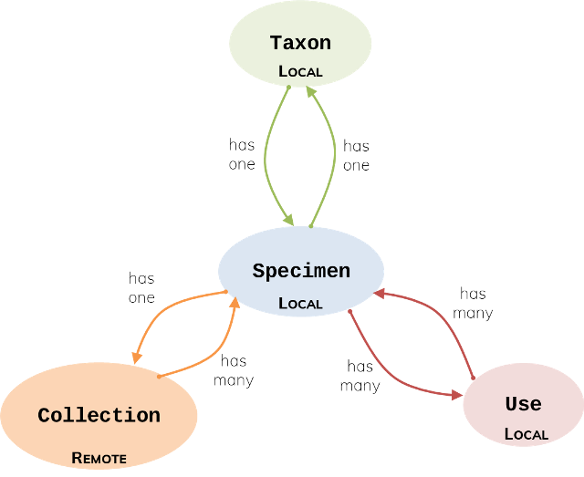
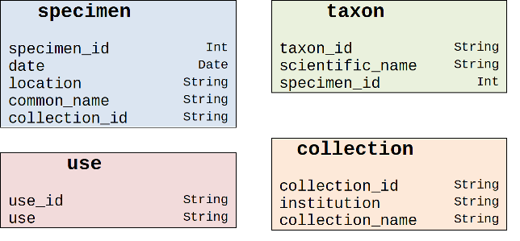

# How to get started: a Zendro guide for non-developers

This guide is aimed at data modelers, data managers and other data users to facilitate collaboration with developers in designing Zendro-generated database systems. We assume that as a data modeler or manager, you might be responsible for structuring your database, and work with a developer or system administrator to set up the project. In this guide we describe and illustrate the requirements for data models, which are the main input for Zendro, and then follow up to describe data uploading options. If you want to dive deeper into the installation process from scratch, see this [tutorial](./setup_root.md) on how to set up a new project.

## Data models

Zendro takes as input a set of data models described in JSON files, from which it automatically generates both the backend and the GUI of a custom data warehouse. To get started, you need a conceptual model or schema of your database, including entities, attributes and their relationships. Each *data model*, that is, each entity with its corresponding attributes and associations to other entities, must be defined as a JSON object in a separate file according to the specifications below. Zendro supports the standard associations One-to-One, One-to-Many, and Many-to-Many, between data models stored either locally or remotely, which we'll also describe in detail. But first, let's introduce an example that will help illustrate model requierements throughout the guide.

### An example

Let's assume we want to create a small database for a herbarium of medicinal plants. We need data models for specimens, taxonomic information, collection information, and uses (Figure 1). In our case, the taxonomic information is specific to each plant, so there is a One-to-One association between specimen and taxon. Each plant can have many uses, just like there are many plants that can serve the same function, so the association between specimen and uses is Many-to-Many. Finally, a specimen belongs to one collection only, but a collection may store multiple specimens, so there is a One-to-Many association between these models (Figure 1).



In this example, information about specimens, taxonomic data and uses is stored in a local server. But we will assume that the information about collections is in a remote database, perhaps one that holds other types of plants, and we would connect to that database to access only the attributes we are interested in.

Next, we need to list the attributes of each model and their data types (Figure 2). Allowed data types are: String, Int, Float, Boolean, [Date, Time and DateTime](https://github.com/excitement-engineer/graphql-iso-date/blob/HEAD/rfc3339.txt). Each model also requires an attribute that serves as the *primary key* or unique identifier of each record.



Foreign keys are also needed to establish the associations to other data models; their location depends on the association type. Note that in Many-to-Many associations, it is necessary to define an additional model for the cross table of foreign-key pairs that define the association. For more details, please read the documentation on associations in [Sequelize](https://sequelize.org/master/manual/assocs.html), on which Zendro is based.

## From conceptual model to JSON

To translate the conceptual diagram into JSON, we need follow the [JSON specifications](./setup_data_scheme.md#json-specs). We present two complete examples below.

```
// Taxon Model
{
    "model": "taxon",

    "storageType": "sql",

    "attributes": {
        "taxon_id": "String",
        "scientific_name": "String",
        "specimen_id": "Int"
    },

    "associations": {
        "specimen_information": { // give your association an informative name
            "type" : "one_to_one",
            "implementation": "foreignkey",
            "reverseAssociation": "taxon_information", // The name of the reverse association defined in the specimen model
            "target": "specimen",
            "targetKey": "specimen_id",
            "keyIn": "taxon",
            "targetStorageType": "sql",
            "label": "common_name",
        },
    },

    "internalId": "taxon_id"
}
```

```
// Collection Model
{
    "model": "collection",

    "storageType": "generic",

    "attributes": {
        "collection_id": "String",
        "institution": "String",
        "collection_name": "String"
    },

    "associations": {
        "medicinal_plants": {
            "type" : "one_to_many",
            "implementation": "foreignkey",
            "reverseAssociation": "collection",
            "target": "specimen",
            "targetKey": "specimen_id",
            "keyIn": "specimen",
            "targetStorageType": "sql",
            "label": "common_name",
            "sublabel": "date"
        },
    },
```


## Data upload

Once the database is generated, you can upload data from a csv file to a Zendro instance directly through the GUI or the API.

### Data format requirements

Data to populate each model in your schema must be in a separate csv file, following the format requirements below:

1. Column names in the first row must correspond to model attributes.
2. Empty values must be represented as `NULL`.
3. Strings, dates and boolean data types must be inside double quotes `""`. Do not quote NULLs or numeric data types.
4. Date and time formats must follow the [RFC 3339](https://tools.ietf.org/html/rfc3339) standard.

### GUI

To upload the csv file through the GUI, go to the model on the left-side panel and use the import button. It will ask you to select a file from your computer and automatically fill the table.

### API

To upload the csv file through the API, you can make a request from the terminal to:

`curl -XPOST [URL] -H 'Content-Type: mulipart/form-data' -F 'query=mutation{ bulkAdd[Model name]Csv }' -F csv_file=@[file path]`

For example:

`curl -XPOST http:/ Zendrodev.conabio.gob.mx:3000/graphql -H 'Content-Type: mulipart/form-data' -F 'query=mutation{ bulkAddSpecimenCsv }' -F csv_file=@specimen.csv`
