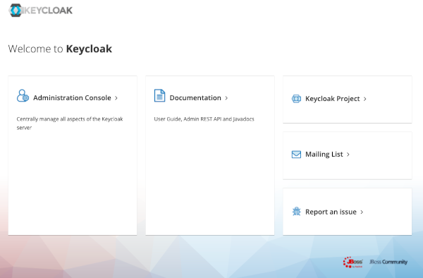
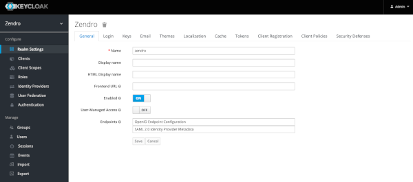
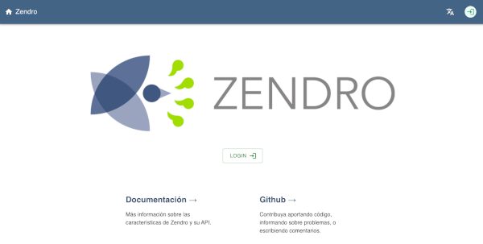
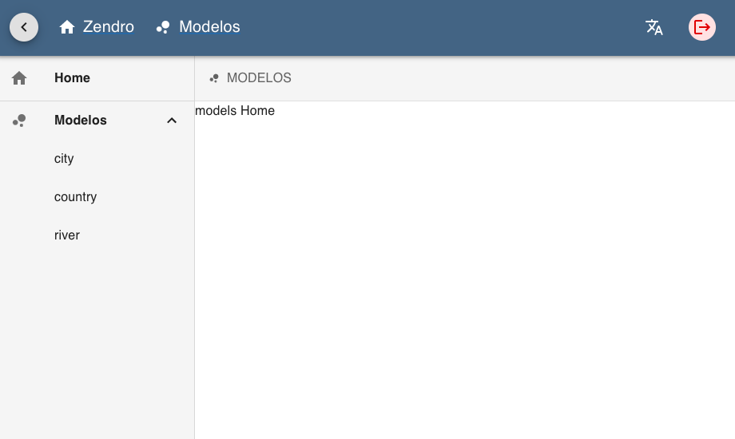
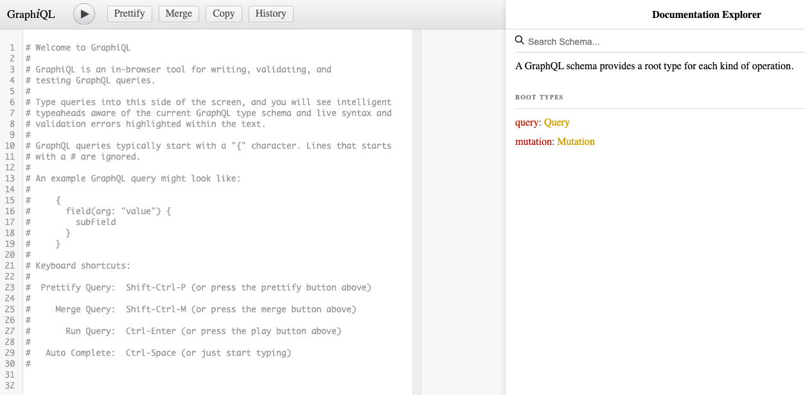
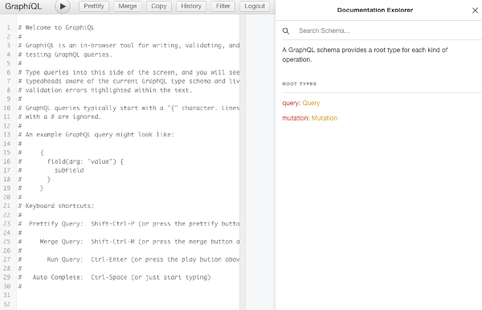

[ &larr; back](README.md)
<br/>
# Quickstart

This is a quickstart guide on how to create a new Zendro project with default parameters. It uses pre-defined datamodels, database and environment variables.

If you want to know more about Zendro or a detailed explanation on how to set up Zendro from scratch, check [this](setup_root.md).

 <br/>

## Project Requirements:
 * [NodeJS](https://nodejs.org/en/)
 * [docker](https://docs.docker.com/get-docker/)
 * [docker-compose](https://docs.docker.com/compose/install/#install-compose)
 <br/><br/>

* * *
### Step 1: Installation

Execute this commands to install Zendro:

```
$ git clone https://github.com/Zendro-dev/zendro.git
$ cd zendro
$ npm install
$ npm link
```

### Step 2: Setup a new Zendro project

The easiest way to set up Zendro is using the [Zendro CLI tool](https://github.com/Zendro-dev/zendro) with minimal steps and configuration. Execute:

```
$ zendro set-up -d <name>
```

By default, three data models with associations will be used for this instance:
* city
* country
* river

Also a default SQLite database will be used. You can find the database on *graphql-server* folder.

### Step 3: Edit environment variables

Edit *NEXTAUTH_SECRET* to your expect secret word in the following files:
* **SPA in development mode:** ./single-page-app/.env.development
* **SPA in production mode:** ./single-page-app/.env.production
* **GraphiQL in development mode:** ./graphql-server/.env.development
* **GraphiQL in production mode:** ./graphql-server/.env.production

If you want to know more about the enviroment variables, you can check [this](env_vars.md).

### Step 4: Start up your Zendro instance

Execute the next command to start Zendro in production mode. 

```
$ zendro dockerize -u -p
```

This command will create docker containers for each Zendro component:
* [Keycloak](https://github.com/Zendro-dev/Zendro-dev.github.io/blob/documentation-vb/oauth.md): manage users and roles
* [Single Page App (SPA)](https://github.com/Zendro-dev/single-page-app): graphical interface to send CRUD requests to a Zendro GraphQL endpoint
* [API](https://github.com/Zendro-dev/graphql-server): CRUD API that can be accessed through a GraphQL query language
* [API with authenthication](https://github.com/Zendro-dev/graphiql-auth): An implementation of the GraphQL IDE with Zendro login

You can check docker containers by:
```
$ docker ps
```

You can check docker logs by:
```
$ docker logs -f <container name>
```

**Please wait until the logs indicate the app is running on XXXX port to access Zendro services.**

In default config, the running containers will be on ports:

* Keycloak: http://10.5.0.11:8081

  
  

* SPA: http://localhost:8080

  
  

* GraphQL API: http://localhost:3000/graphql

  

* GraphQL API with authenthication: http://localhost:7000

  
  

* The default keycloak username is *admin* and the password is *admin*.

* The default zendro username is *zendro-admin* and the password is *admin*.

Also, for the default database you can install *sqlite3* with:

```
$ sudo apt install sqlite3
```

Then, go to *graphql-server* folder and run:

```
$ sqlite3 data.db
```

You can see tables and do querys inside sqlite by:
```
sqlite> .tables
sqlite> SELECT * FROM <table>;
sqlite> .exit
```

### Step 5: Stop your Zendro instance

Execute the next command to stop Zendro and remove all volumes.

```
$ zendro dockerize -d -p -v
```

